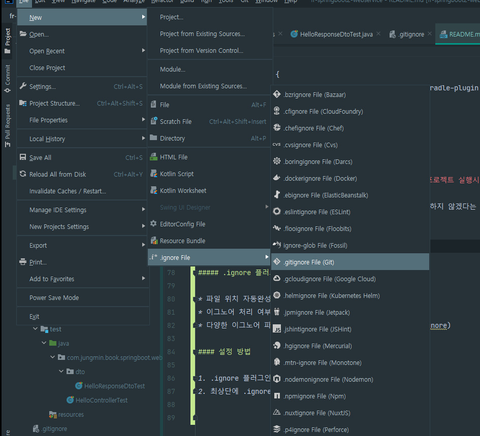
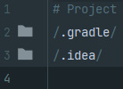
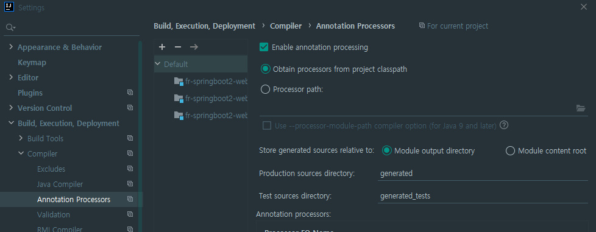
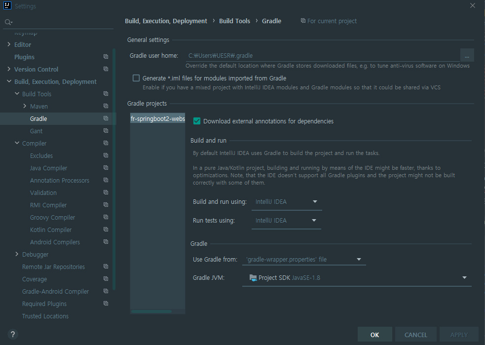
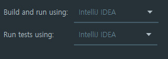
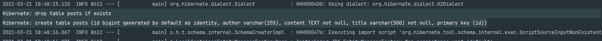
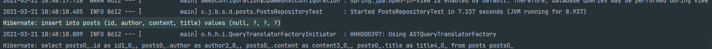
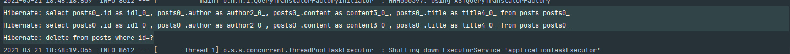
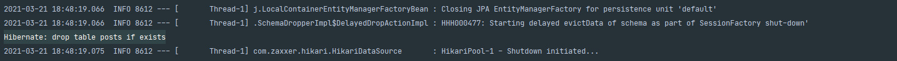

# 스프링 부트와 AWS로 혼자 구현하는 웹 서비스

## 목차

## 1장. 인텔리제이로 스프링 부트 시작하기

### 1.4 그레이들 프로젝트를 스프링 부트 프로젝트로 변경하기

* 아래의 코드를 build.gradle에 작성 (기존에 있던 코드들은 지워버림)

    ```build.gradle
    buildscript {
        ext {
            springBootVersion = '2.1.7.RELEASE'
        }
        repositories {
            mavenCentral()
            jcenter()
        }
        dependencies {
            classpath("org.springframework.boot:spring-boot-gradle-plugin:${springBootVersion}")
        }
    }
    
    apply plugin: 'java'
    apply plugin: 'eclipse'
    apply plugin: 'org.springframework.boot'
    apply plugin: 'io.spring.dependency-management'
    
    group 'com.jungmin'
    version '1.0-SNAPSHOT'
    sourceCompatibility = 1.8
    
    
    repositories {
        mavenCentral()
    }
    
    dependencies {
        compile('org.springframework.boot:spring-boot-starter-web')
        compile('org.projectlombok:lombok')
        testCompile('org.springframework.boot:spring-boot-starter-test')
    }
    
    ```

    * [스프링 이니셜라이져](http://start.spring.io/) 를 이용하지 않고 직접 build.gradle에 코드를 추가해서 진행
    * `buildscript` : 프로젝트의 플러그인 의존성 관리를 위한 설정
        * `ext` : 전역변수 설정
        * `springBootVersion` 이름의 전역 변수 생성
        * `2.1.7.RELEASE`값을 `springBootVersion`에 저장
          <br><br>
    * `apply plugin:` : 플러그인 의존성들을 적용할 것인지 결정
        * `io.spring.dependency-management` : 스프링 부트의 의존성들을 관리해 주는 플러그인
          <br><br>
    * `repositories` : 각종 의존성(라이브러리)들을 어떤 원격 저장소에서 받을지를 결정
        * 기본적으로는 mavenCentral
        * 라이브러리 업로드 난이도 때문에 jcenter도 많이 사용
        * jcenter에 라이브러리를 업로드하면 mavenCentral에도 자동적으로 업로드
    * `dependencies` : 프로젝트 개발에 필요한 의존성들을 선언
        * `org.springframework.boot:spring-boot-starter-web`
        * `org.springframework.boot:spring-boot-starter-test`
        * 특정 버전을 명시하지 말아야 함 -> 아래의 코드에 명시한 버전을 따라가도록 하기 위함
        ```
          dependencies {
            classpath("org.springframework.boot:spring-boot-gradle-plugin:${springBootVersion}")
        }
      ```

### 1.5 인텔리제이에서 깃과 깃허브 사용하기

* 커밋과정은 내가 알고 있으므로 생략
* **.idea 디렉토리는 커밋하지 않는다.** 이 폴더의 파일들은 **프로젝트 실행시 자동으로 생성되는 파일들이다.**
* .idea 폴더를 앞으로의 모든 커밋 대상에서 제외되도록 처리
* .gitignore 파일 : 파일 안에 기입된 내용들은 모두 깃에서 관리하지 않겠다는 것을 의미
* 인텔리제이에서는 .gitignore 파일에 대한 기본적인 지원이 없음
* 대신에 플러그인에서 .gitignore 지원
  <br><br>

##### .ignore 플러그인 기능

* 파일 위치 자동완성
* 이그노어 처리 여부 확인
* 다양한 이그노어 파일 지원(.gitignore, .npmignore, .dockergnore)

#### 설정 방법

1. .ignore 플러그인 설치(프로그램 재부팅 필요)
2. 최상단에 .ignore file(Git) 생성
   
3. gitignore에 코드 등록<br><br>
   
4. gitignore 파일 commit

## 2장. 스프링 부트에서 테스트 코드를 작성하자

* TDD 혹은 최소한의 테스트 코드는 필수 조건이다.
* 코테에서도 단위 테스트가 나오는 경우도 있음

### 2.1 테스트 코드 소개

* TDD : 테스트가 주도하는 개발 (**테스트 코드를 먼저 작성하는것부터 시작**)
* 단위 테스트 : TDD의 첫 번째 단계인 **기능 단위의 테스트 코드를 작성** 하는것
    * 테스트 코드를 먼저 작성할 필요는 없음
    * 리팩토링도 포함되지 않음
    * 순수하게 테스트 코드만 작성하는 것     
      <br>

* 테스트 코드의 장점
    * 단위 테스트는 개발단계 초기에 문제를 발견하게 도와준다.
    * 단위 테스트는 개발자가 나중에 코드를 리팩토링하거나 라이브러리 업그레이드 등에서 기존 기능이 올바르게 작동하는지 확인할 수 있다.(회귀 테스트 ??)
    * 단위 테스트는 기능에 대한 불확실성을 감소시킬 수 있다.
    * 단위 테스트는 시스템에 대한 실제 문서를 제공한다. 즉 단위 테스트 자체가 문서로 사용될 수 있다.
    * 그 외...(작가님의 경험담...)
        * 빠른 피드백
        * 테스트 할때마다 톰캣을 내렸다가 다시 실행하는 일 불필요
        * 눈으로 직접 검증할 필요 없음 (System.out.println()) - 자동 검증
        * 개발자가 만든 기능을 안전하게 보호
          <br>
* 테스트를 도와주는 프레임워크 **xUnit**
    * JUnit - Java
    * DBUnit - DB
    * CppUnit - C++
    * NUnit - .net

### 2.2 Hello Controller 테스트 코드 작성하기

* 일반적으로 패키지명은 웹 사이트 주소의 역순
    * 예) www.admin.jungmin.com -> com.jungmin.admin

* com.jungmin.book.springboot 패키지 생성
* `Application` 클래스 생성

    ```java
    package com.jungmin.book.springboot;
    
    import org.springframework.boot.SpringApplication;
    import org.springframework.boot.autoconfigure.SpringBootApplication;
    
    @SpringBootApplication
    public class Application {
        public static void main(String[] args) {
            SpringApplication.run(Application.class, args);
        }
    }
    ```

    * `Application`클래스: 앞으로의 **메인 클래스**
    * `@SpringBootApplication`: 스프링 부트의 자동 설정, 스프링 Bean 읽기와 생성을 모두 자동으로 설정
        * **`@SpringBootApplication`이 있는 위치부터 설정을 읽어감**
        * **프로젝트의 최상단에 위치**
    * main 함수의 `SpringApplication.run`: 내장 WAS(Web Application Server)를 실행
        * 내장 WAS: 별도로 외부에 WAS를 두지 않고 애플리케이션을 실행할 때 내부에서 WAS를 실행하는 것
        * **항상 서버에 톰캣을 설치할 필요가 없음**
        * 스프링 부트로 만들어진 `Jar`파일(실행 가능한 Java 패키징 파일)로 실행하면 된다
        * 스프링 부트에서도 **내장 WAS를 사용하는 것을 권장**
        * 외장 WAS를 사용하면 모든 서버는 WAS의 종류와 버전, 설정을 일치시켜야 한다는 단점이 존재
          <br><br>

* 테스트를 위한 Controller 생성
    * `web`패키지 생성 (`com.jungmin.book.springboot.web`): **컨트롤러와 관련된 모든 클래스 위치**
    * `HelloController`클래스 생성

        ```java
        package com.jungmin.book.springboot.web;
        
        import com.jungmin.book.springboot.web.dto.HelloResponseDto;
        import org.springframework.web.bind.annotation.GetMapping;
        import org.springframework.web.bind.annotation.RequestParam;
        import org.springframework.web.bind.annotation.RestController;
        
        @RestController
        public class HelloController {
        
            @GetMapping("/hello")
            public String hello() {
                return "hello";
            }
        
            @GetMapping("/hello/dto")
            public HelloResponseDto helloDto(@RequestParam("name") String name, @RequestParam("amount") int amount) {
                return new HelloResponseDto(name, amount);
            }
        }
        ```
    * `@RestController`
        * 컨트롤러를 JSON을 반환하는 컨트롤러로 만들어 준다. (뭔말이지???)
        * 예전에는 `@ResponseBody`를 각 메소드마다 선언했던 것을 한번에 사용할 수 있게 해준하고 생각하면 된다.
    * `@GetMapping`
        * HTTP Method인 Get의 요청을 받을 수 있는 API를 만들어 준다.
        * /hello로 요청이 오면 문자열 hello를 반환하는 기능을 가지게 되었다.
        * 예전에는 @RequestMapping(method = RequestMethod.GET)으로 사용되었다.


* 테스트 패키지에서 동일한 경로로 패키지들을 생성
* 사실 따로 생성할 필요 없이 클래스에 `Alt+ins`에서 `test...`를 선택하면 자동으로 패키지와 클래스까지 생성해준다.
* `HelloControllerTest`클래스 생성 (**테스트 대상 클래스 이름에 Test를 붙인다.**)
* 다음 단계에 필요한 static method도 import 되어 있어서 불필요한 것들이 있음
* **_아직 그 기능이 이해가 가지 않는 메소드, 애노테이션이 존재함 ㅠㅠ_**
    ```java
    package com.jungmin.book.springboot.web;

    import org.junit.Test;
    import org.junit.runner.RunWith;
    import org.springframework.beans.factory.annotation.Autowired;
    import org.springframework.boot.test.autoconfigure.web.servlet.WebMvcTest;
    import org.springframework.test.context.junit4.SpringRunner;
    import org.springframework.test.web.servlet.MockMvc;
    
    import static org.hamcrest.Matchers.is;
    import static org.springframework.test.web.servlet.request.MockMvcRequestBuilders.get;
    import static org.springframework.test.web.servlet.result.MockMvcResultMatchers.content;
    import static org.springframework.test.web.servlet.result.MockMvcResultMatchers.jsonPath;
    import static org.springframework.test.web.servlet.result.MockMvcResultMatchers.status;
    
    @RunWith(SpringRunner.class)
    @WebMvcTest
    public class HelloControllerTest {
    
        @Autowired
        private MockMvc mvc;
    
        @Test
        public void hello가_리턴된다() throws Exception {
    
            String hello = "hello";
    
            mvc.perform(get("/hello"))
                    .andExpect(status().isOk())
                    .andExpect(content().string(hello));
        }
    }
    ```
    * `@RunWith(SpringRunner.class)`
        * 테스트를 진행할 때 JUnit에 내장된 실행자 외에 다른 실행자를 실행 시킨다.
        * 여기서는 SpringRunner 라는 스프링 실행자를 사용
        * 즉, 스프링 부트 테스트와 JUnit 사이에 연결자 역할을 한다.
    * `@WebMvcTest`
        * 여러 스프링 테스트 어노테이션 중, Web(Spring MVC)에 집중할 수 있는 어노테이션이다.
        * 선언할 경우 `@Controller`, `@ControllerAdvice`등을 사용할 수 있다.
        * 단, `@Service`, `@Component`, `@Repository`등은 사용할 수 없다.
        * 여기서는 컨트롤러만 사용하기 때문에 선언한다.
    * `@Autowired`
        * 스프링이 관리하는 빈(Bean)을 주입 받는다.
    * `private MockMvc mvc`
        * 웹 API를 테스트할 때 사용한다.
        * 스프링 MVC 테스트의 시작점이다.
        * 이 클래스를 통해 HTTP GET, POST 등에 대한 API 테스트를 할 수 있다.
    * `mvc.perform(get("/hello"))`
        * `MockMvc`를 통해 `/hello` 주소로 HTTP GET 요청을 한다.
        * 체이닝이 지원되어 아래와 같이 여러 검증 기능을 이어서 선언할 수 있다.
    * `.andExpect(status().isok())`
        * mvc.perform의 결과를 검증한다.
        * HTTP Header 의 Status를 검증한다.
        * 우리가 흔히 알고 있는 200, 404, 500 등의 상태를 검증한다.
        * 여기선 OK 즉, 200인지 아닌지를 검증한다.
    * `.andExpect(content().string(hello))`
        * `mvc.perform`의 결과를 검증한다.
        * 응답 본문의 내용을 검증한다.
        * `Controller`에서 "hello"를 리턴하기 때문에 이 값이 맞는지 검증한다.

### 2.3 롬복 소개 및 설치하기

* 자바 개발자들의 필수 라이브러리
* Getter, Setter, 기본생성자, toString 등을 어노테이션으로 자동 생성


* build.gradle에 다음의 코드 추가

```
dependencies {
    compile('org.springframework.boot:spring-boot-starter-web')
    compile('org.projectlombok:lombok') // 추가한 코드
    testCompile('org.springframework.boot:spring-boot-starter-test')
}
```

* 플러그인 설치
* 롬복 설정
    * Settings > Build > Compiler > Annotation Processors > `Enable annotation processing` 체크
      

### 2.4 Hello Controller 코드를 롬복으로 전환하기

* web 패키지에 dto 패키지 추가 (**모든 응답 Dto는 이 Dto 패키지에 추가**)
* `HelloResponseDto`클래스 생성
    ```java
    package com.jungmin.book.springboot.web.dto;
    
    import lombok.Getter;
    import lombok.RequiredArgsConstructor;
    
    @Getter
    @RequiredArgsConstructor
    public class HelloResponseDto {
    
        private final String name;
        private final int amount;
    }
    
    ```
    * `@Getter`
        * 선언된 모든 필드의 get 메소드를 생성해 준다.
    * `@RequiredArgsConstructor`
        * 선언된 모든 final 필드가 포함된 생성자를 생성해준다.
        * final 이 없는 필드는 생성자에 포함되지 않는다.

* `HelloResponseDtoTest` 클래스 생성

    ```java
    package com.jungmin.book.springboot.web.dto;
    
    import org.junit.Test;
    
    import static org.assertj.core.api.Assertions.assertThat;
    
    public class HelloResponseDtoTest {
    
        @Test
        public void 롬복_기능_테스트() {
            // given
            String name = "test";
            int amount = 1000;
    
            //when
            HelloResponseDto dto = new HelloResponseDto(name, amount);
    
            //then
            assertThat(dto.getName()).isEqualTo(name);
            assertThat(dto.getAmount()).isEqualTo(amount);
        }
    }
    ```
    * `assertThat`
        * `assertj`라는 테스트 검증 라이브러리의 검증 메소드
        * 검증하고 싶은 대상을 메소드 인자로 받는다.
        * 메소드 체이닝이 지원되어 `isEqualTo`와 같은 메소드를 이어서 사용할 수 있다.
    * `isEqualTo`
        * `assertj`의 동등 비교 메소드
        * `assertThat`에 있는 값과 `isEqualTo`의 값을 비교해서 같을 때만 성공
    * **`assertThat`은 Junit의 기본 `assertThat`이 아닌 `assertj`의 `assertThat`을 사용!!!**
    * `assertj`의 장점
        * `CoreMatchers`와 달리 추가적으로 라이브러리가 필요하지 않는다.
            * Junit의 `assertThat`을 쓰면 `is()`와 같이 `CoreMatchers`라이브러리가 필요하다.
        * 자동완성이 좀 더 확실하게 지원된다.
            * IDE에서는 `CoreMatchers`와 같은 `Matcher`라이브러리의 자동완성 지원이 약하다.
        * [참고 사이트](http://bit.ly/30vm9Lg)


* 여기까지 왔으면 문제가 2가지가 생긴다.
    * dto 테스트 메소드가 통과되지 않는다.
      
        * 이 문제는 gradle 버전이 5 이상이면 일어나는 문제이다.
        * terminal에 `gradlew wrapper --gradle-version 4.10.2`를 작성한다. (gradle 버전 다운그래이드)
        * 현재는 gradle 버전이 6까지가 나왔고 [작가님 블로그](https://jojoldu.tistory.com/539) 에 최신 버젼에서의 설정방법이 있다. (이 밖에도 다른 모든 요소에 대한
          최신화가 있음)
        * 하지만 결국 그 방법들도 언젠가는 정상 작동하지 않을것이고, 중요한 것은 **왜 안되는지 로그를 보고 검색하는 습관이다.**
          <br><br>
    * 테스트 결과 창에 한글로 명명한 메소드 이름이 깨져서 나온다.
        * Setting > Build tools > Gradle
          
        * Build and run using: Intellij IDEA
        * Run tests using: Intellij IDEA
          <br>
          
        * 김영한 팀장님 강의에서도 이렇게 설정했는데 속도도 조금 더 빠르다고 한다.


* `HelloController`에도 새로 만든 `ResponseDto` 사용
    ```java
    package com.jungmin.book.springboot.web;
    
    import com.jungmin.book.springboot.web.dto.HelloResponseDto;
    import org.springframework.web.bind.annotation.GetMapping;
    import org.springframework.web.bind.annotation.RequestParam;
    import org.springframework.web.bind.annotation.RestController;
    
    @RestController
    public class HelloController {
    
        @GetMapping("/hello")
        public String hello() {
            return "hello";
        }
    
        @GetMapping("/hello/dto")
        public HelloResponseDto helloDto(@RequestParam("name") String name, @RequestParam("amount") int amount) {
            return new HelloResponseDto(name, amount);
        }
    }
    
    ```
    * `@RequestParam`
        * 외부에서 API로 넘긴 파라미터를 가져오는 어노테이션
        * 여기서는 외부에서 `name (@RequestParam("name"))`이란 이름으로 넘긴 파라미터를 메소드 파라미터 `name(String name)`에 저장한다.

* 추가된 API를 테스트하는 코드를 `HelloControllerTest`에 추가
    ```java
    package com.jungmin.book.springboot.web;
    
    import org.junit.Test;
    import org.junit.runner.RunWith;
    import org.springframework.beans.factory.annotation.Autowired;
    import org.springframework.boot.test.autoconfigure.web.servlet.WebMvcTest;
    import org.springframework.test.context.junit4.SpringRunner;
    import org.springframework.test.web.servlet.MockMvc;
    
    import static org.hamcrest.Matchers.is;
    import static org.springframework.test.web.servlet.request.MockMvcRequestBuilders.get;
    import static org.springframework.test.web.servlet.result.MockMvcResultMatchers.content;
    import static org.springframework.test.web.servlet.result.MockMvcResultMatchers.jsonPath;
    import static org.springframework.test.web.servlet.result.MockMvcResultMatchers.status;
    
    @RunWith(SpringRunner.class)
    @WebMvcTest
    public class HelloControllerTest {
    
        @Autowired
        private MockMvc mvc;
    
        @Test
        public void hello가_리턴된다() throws Exception {
    
            String hello = "hello";
    
            mvc.perform(get("/hello"))
                    .andExpect(status().isOk())
                    .andExpect(content().string(hello));
        }
    
        @Test
        public void helloDto가_리턴된다() throws Exception {
            String name = "hello";
            int amount = 1000;
    
            mvc.perform(
                    get("/hello/dto")
                            .param("name", name)
                            .param("amount", String.valueOf(amount)))
                    .andExpect(status().isOk())
                    .andExpect(jsonPath("$.name", is(name)))
                    .andExpect(jsonPath("$.amount", is(amount)));
        }
    }
    ```
    * `param`
        * API테스트할 때 사용될 요청 파라미터를 설정
        * 단, 값은 `String`만 허용
        * 그래서 숫자/날짜 등의 데이터도 등록할 때는 문자열로 변경해야만 가능
    * `jsonPath`
        * JSON 응답값을 필드별로 검증할 수 있는 메소드
        * `$`를 기준으로 필드명을 명시
        * 여기서는 `name`과 `amount`를 검증하니 `$.name, $.amount`로 검증한다.

## 3장. 스프링 부트에서 JPA로 데이터베이스 다뤄보자

### 3.1 JPA 소개

* 객체를 관계형 데이터베이스에 관리하는 것의 중요성
* 이전에는 애플리케이션 코드보다 SQL로 가득한 프로젝트가 다반사 (SQL 중심의 코딩)
* **패러다임 불일치**
* 관계형 데이터베이스 - 어떻게 더이터를 저장할 것인가
* 객체지향 프로그래밍 - 기능과 속성을 한 곳에서 관리
* 둘은 사상부터 다른 시작점에서 출발, 즉 객체를 데이터베이스에 저장하려고 하는 여로 문제가 발생
* **JPA는 중간에서 패러다임 일치**를 시켜주기 위한 기술
* **SQL에 종속적인 개발을 하지 않아도 됨**

#### Spring Data Jpa

* JPA를 다루기 위해서는 Hibernate, Eclipse Link 와 같은 구현체가 필요함
* 하지만 Spring에서는 이런 구현체를 직접 다루지 않고 **Spring Data JPA**라는 모듈을 이용하여 JPA를 다룸
* JPA < Hibernate < Spring Data JPA
* Spring Data JPA 의 장점
    * **구현체 교체의 용이성** : Hibernate 외에 다른 구현체로 쉽게 교체 가능
    * **저장소 교체의 용이성** : 관계형 데이터베이스 와에 다른 저장소로 쉽게 교체 가능

### 3.2 프로젝트에 Spring Data Jpa 적용하기

```
// build.gradle
dependencies {
    compile('org.springframework.boot:spring-boot-starter-web')
    compile('org.projectlombok:lombok')
    compile('org.springframework.boot:spring-boot-starter-data-jpa') // 추가1
    compile('com.h2database:h2') // 추가2
    testCompile('org.springframework.boot:spring-boot-starter-test')
}
```

1. spring-boot-starter-data-jpa
    * 스프링 부트용 Spring Data Jpa 추상화 라이브러리
    * 스프링 부트 버전에 맞춰 자동으로 JPA 관련 라이브러리들의 버전을 관리

2. h2
    * 인메모리 관계형 데이터베이스
    * 별도의 설치가 필요 없이 프로젝트 의존성만으로 관리 가능
    * 메모리에서 실행되기 때문에 애플리케이션을 재시갖할 때마다 초기화된다는 점을 이용하여 테스트 용도로 많이 쓰임
    * 현 프로젝트에서 JPA의 테스트, 로컬 환경에서의 구동에서 사용할 예정

#### domain package

* domain : 게시글, 댓글, 회원, 정산, 결제 등 소프트웨어에 대한 요구사항, 혹은 문제영역


* domain 패키지에 post패키지와 `Post`클래스 생성

    ```java
    package com.jungmin.book.springboot.domain.posts;
    
    import com.jungmin.book.springboot.domain.BaseTimeEntity;
    import lombok.Builder;
    import lombok.Getter;
    import lombok.NoArgsConstructor;
    
    import javax.persistence.*;
    
    @Getter
    @NoArgsConstructor
    @Entity
    public class Posts extends BaseTimeEntity {
    
        @Id
        @GeneratedValue(strategy = GenerationType.IDENTITY)
        private Long id;
    
        @Column(length = 500, nullable = false)
        private String title;
    
        @Column(columnDefinition = "TEXT", nullable = false)
        private String content;
    
        private String author;
    
        @Builder
        public Posts(String title, String content, String author) {
            this.title = title;
            this.content = content;
            this.author = author;
        }
    }
    
    ```
    * 주요 어노테이션을 클래스에 가깝게 두기
    * `Post`클래스는 실제 DB의 테이블과 매칭될 클래스
    * 보통 **Entity 클래스** 라고도 함
    * DB 데이터에 작업할 경우 실제 쿼리를 날리기보다는, 이 Entity 클래스의 수정을 통해 작업을 한다.
    * `@Entity`
        * 테이블과 링크될 클래스임을 나타낸다.
        * 기본값으로 클래스의 카멜케이스 이름을 언더스코어 네이밍(_)으로 테이블 이름을 매칭한다.
    * ex) SalesManager.java -> sales_manager table
    * `@Id`
        * 해당 테이블의 PK 필드를 나타낸다.
    * `@GeneratedValue`
        * PK의 생성 규칙을 나타낸다.
        * 스프링 부트 2.0에서는 GenerationType.IDENTITY 옵션을 추가해야만 auto-increment가 된다.
    * `@Column`
        * 테이블의 칼럼을 나타내며 굳이 선언하지 않더라도 해당 클래스의 필드는 모두 칼럼이 된다.
    * 사용하는 이유는, 기본값 외에 추가로 변경이 필요한 옵션이 있으면 사용한다.
    * 문자열의 경우 VARCHAR(255)가 기본값인데, 사이즈를 500으로 늘리고 싶거나(title), 타입을 TEXT로 변경하고 싶거나(content) 등의 경우에 사용된다.
    * `@NoArgsConstructor`
        * 기본 생성자 자동 추가
        * public Posts(){}와 같은 효과
    * `@Getter`
        * 클래스 내 모든 필드의 Getter 메소드 자동 생성
    * `@Builder`
        * 해당 클래스의 빌더 패턴 클래스를 생성
        * 생성자 상단에 선언 시 생성자에 포함된 필드만 빌더에 포함

    * **Entity 클래스에서는 절대 Setter 메소드를 만들지 않는다!!!**


* `Post`클래스로 Database를 접근하게 해줄 `JpaRepository`생성

    ```java
    package com.jungmin.book.springboot.domain.posts;
    
    import org.springframework.data.jpa.repository.JpaRepository;
    
    public interface PostsRepository extends JpaRepository<Posts, Long> {
    
    }
    
    ```
    * 보통 ibatis 나 MyBatis 등에서 Dao(Data Access Object)라고 불리는 DB Layer 접근자
    * `JpaRepository<Entity 클래스, PK 타입>`를 상속하면 기본적인 CRUD 메소드가 자동으로 생성
    * **이후 `@Repository`를 추가할 필요가 없다.**
    * **주의할점은 Entity클래스와 기본 Entity Repository는 함께 위치**

### 3.3 Spring Data JPA 테스트 코드 작성하기

* `PostsRepositoryTest`에서는 save, finaAll 기능을 테스트

    ```java
    package com.jungmin.book.springboot.domain.posts;
    
    import org.junit.After;
    import org.junit.Test;
    import org.junit.runner.RunWith;
    import org.springframework.beans.factory.annotation.Autowired;
    import org.springframework.boot.test.context.SpringBootTest;
    import org.springframework.test.context.junit4.SpringRunner;
    
    import java.time.LocalDateTime;
    import java.util.List;
    
    import static org.assertj.core.api.Assertions.assertThat;
    
    @RunWith(SpringRunner.class)
    @SpringBootTest
    public class PostsRepositoryTest {
    
        @Autowired
        PostsRepository postsRepository;
    
        @After
        public void cleanup() {
            postsRepository.deleteAll();
        }
    
        @Test
        public void 게시글저장_불러오기() {
            // given
            String title = "테스트 게시글";
            String content = "테스트 본문";
    
            postsRepository.save(Posts.builder()
                    .title(title)
                    .content(content)
                    .author("soato1405@gmain.com")
                    .build());
    
            // when
            List<Posts> postsList = postsRepository.findAll();
    
            // then
            Posts posts = postsList.get(0);
            assertThat(posts.getTitle()).isEqualTo(title);
            assertThat(posts.getContent()).isEqualTo(content);
        }
    }
    ```
    * `@After`
        * Junit에서 단위 테스트가 끝날 때마다 수행되는 메소드를 지정
        * 보통은 배포 전 전체 테스트를 수행할 때 테스트간 데이터 침범을 막기위해 사용
        * 여러 테스트가 동시에 수행되면 테스트용 데이터베이스인 H2에 데이터가 그대로 남아 았어 다음 테스트 실행 시 테스트가 실패할 수 있다.
    * `postsRepository.save`
        * 테이블 posts에 insert/update 쿼리를 실행
        * id값이 있다면 update, 없다면 insert 쿼리가 실행
    * `postsRepository.findAll`
        * 테이블 posts에 있는 모든 데이터를 조회해오는 메소드


* 테스트 코드의 실제 쿼리문 확인하기
    * `src/main/resource`디렉토리 아래에 `application.properties`파일 생성
    * `spring.jpa.show_sql=true` 코드 작성
    * 결과값
      
      
      
      
    * 쿼리 로그를 MySQL 버전으로 변경
        * `spring.jap.properties.hibernate.dialect=org.hibernate.dialect.MySQL5InnoDBDialect` 추가

### 3.4 등록/수정/조회 API 만들기

* 필요한 클래스
    * Request 데이터를 받을 Dto
    * API 요청을 받을 Controller
    * 트랜잭션, 도메인 기능 간의 순서를 보장하는 Service

* Spring 웹 계층
    * **Web Layer**
        * 흔히 사용하는 컨트롤러(`@Controller`)와 JSP/Freemarker등의 뷰 템플릿 영역
        * 이외에도 필터(`@Filter`), 인터셉터, 컨트롤러 어드바이스(`@ControllerAdvice)등 **외부 요청과 응답**에 대한 전반적인 영역을 이야기함
    * **Service Layer**
        * `@Service`에 사용되는 서비스 영역
        * 일반적으로 Controller와 Dao의 중간영역에서 사용된다.
        * `@Transactional`이 사용되어야 하는 영역
    * **Repository Layer**
        * Database와 같이 데이터 저장소에 접근하는 영역
        * 이전에는 Dao(Data Access Object) 영역과 비슷
    * **Dtos**
        * Dto(Data Transfer Object)는 **계층 간에 데이터 교환을 위한 객체**를 이야기 하며, Dtos는 이들으 영역
        * 예를 들어 뷰 템플릿 엔진에서 사용될 객체나 Repository Layer에서 결과로 넘겨준 객체 등이 이들을 이야기 함
    * **Domain Model**
        * 도메인이라 불리는 개발 대상을 모든 사람이 동일한 관점에서 이해할 수 있고 공유할 수 있도록 단순화시킨 것
        * 이를테면 택시 앱이라고 하면 배차, 탑승, 요금 등이 모두 도메인이 될수 있다.
        * `@Entity`가 사용된 영역 역시 도메인 모델이다.
        * 다만, 무조건 데이터베이스의 테이블과 관계가 있어야만 하는 것은 아니다.
        * VO처럼 값 객체들도 이 영역에 해당하기 때문 (VO???)
    * **서비스 메소드는 트랜젝션과 도메인간의 순서만 보장**
    * **실제 비즈니스 로직은 도메인**

**여기서 부터 책에는 코드 설명이 거의 없다**

* web/PostsApiController

    ```java
    package com.jungmin.book.springboot.web;
    
    import com.jungmin.book.springboot.service.posts.PostsService;
    import com.jungmin.book.springboot.web.dto.PostsResponseDto;
    import com.jungmin.book.springboot.web.dto.PostsSaveRequestDto;
    import com.jungmin.book.springboot.web.dto.PostsUpdateRequestDto;
    import lombok.RequiredArgsConstructor;
    import org.springframework.web.bind.annotation.*;
    
    @RequiredArgsConstructor
    @RestController
    public class PostsApiController {
    
        private final PostsService postsService;
    
        @PostMapping("/api/v1/posts")
        public Long save(@RequestBody PostsSaveRequestDto requestDto) {
            return postsService.save(requestDto);
        }
    }
    
    ```
    * requestDto 객체를 받아서 저장을 하는 Controller


* service/PostsService
    ```java
    package com.jungmin.book.springboot.service.posts;
    
    import com.jungmin.book.springboot.domain.posts.Posts;
    import com.jungmin.book.springboot.domain.posts.PostsRepository;
    import com.jungmin.book.springboot.web.dto.PostsResponseDto;
    import com.jungmin.book.springboot.web.dto.PostsSaveRequestDto;
    import com.jungmin.book.springboot.web.dto.PostsUpdateRequestDto;
    import lombok.RequiredArgsConstructor;
    import org.springframework.stereotype.Service;
    import org.springframework.transaction.annotation.Transactional;
    
    @RequiredArgsConstructor
    @Service
    public class PostsService {
        private final PostsRepository postsRepository;
    
        @Transactional
        public Long save(PostsSaveRequestDto requestDto) {
            return postsRepository.save(requestDto.toEntity()).getId();
        }
    }
    
    ```
    * Controller와 Service에서 `@Autowired`가 없음
    * `@Autowired`로 의존성을 주입받는 방법 보다는 생성자로 주입받는 방법을 권장
    * 생성자는 롬복 어노테이션인 `@RequiredArgsConstructor`에서 해결
    * **final이 선언된 모든 필드**를 인자값으로 하는 생성자를 롬복이 대신 생성
    * 이로써 해당 클래스의 의존성 관계가 변경될 때마다 생성자 코드를 계속해서 수정하는 번거로움을 해결

* web/dto/PostsSaveRequestDto

    ```java
    package com.jungmin.book.springboot.web.dto;
    
    import com.jungmin.book.springboot.domain.posts.Posts;
    import lombok.Getter;
    
    @Getter
    public class PostsResponseDto {
    
        private Long id;
        private String title;
        private String content;
        private String author;
    
        public PostsResponseDto(Posts entity) {
            this.id = entity.getId();
            this.title = entity.getTitle();
            this.content = entity.getContent();
            this.author = entity.getAuthor();
        }
    }
    
    ```
    * `Entity`클래스와 유사한 형태임에도 `Dto`클래스를 추가함
    * **절대로 Entity 클래스를 Request/Response 클래스로 사용해서는 안된다.**
    * Entity 클래스는 DB와 맞다은 핵심 클래스 - Entity 클래스를 기준으로 테이블이 생성되고, 스키마가 변경됨
    * 수많은 서비스 클래스나 비즈니스 로직들이 Entity 클래스를 기준으로 동작한다.
    * **Entity 클래스가 변경되면 여러 클래스에 영향을 끼치지만, Request와 Response용 Dto는 View를 위한 클래스라 정말 자주 변경이 필요함** 따라서 View Layer와 DB
      Layer의 역할 분리를 철저하게 하는것이 좋음
    * **꼭 Entity 클래스와 Controller에서 쓸 Dto는 분리해서 사용해야 한다**

****

# Note

### `@RestController`

### `@RequestBody`

### `@Service`

### `@LocalServerPosrt`

### `TestRestTemplate`

이름만 보면 `RestTemplate`의 테스트 버전으로 보면 될것 같다. 그러면 `RestTemplate`은 무엇인가...

### `SpringBootTest(webEnvironment = SpringBootTest.WebEnvironment.RANDOM_PORT)`

* 테스트에 사용할 ApplicationContext를 쉽게 생성하고 조작
* 전체 빈 중 특정 빈을 선택하여 생성
* 특정 빈을 Mock으로 대체
* 테스트에 사용할 프로퍼티 파일을 선택하거나 특정 속성만 추가
* 특정 Configuration을 선택하여 설정
* 반드시 `@RunWith(SpringRunner.class)`와 함께 사용

### `ResponseEntity<Long> responseEntity = restTemplate.postForEntity(url, requestDto, Long.class)`

[참고 블로그](https://devlog-wjdrbs96.tistory.com/182)       
Spring Framework에서 제공하는 클래스 주에 HttpEntity 라는 클래스가 존재한다. 이것은 HTTP 요청(Request) 또는 응답(Response)에 해당하는 HttpHeader와 HttpBody를
포함하는 클래스이다.

```java
import java.net.http.HttpHeaders;

public class HttpEntity<T> {
    private final HttpHeaders headers;

    @Nullable
    private final T body;
}
```

```
public class RequestEntity<T> extends HttpEntity<T>
public class ResponseEntity<T> extends HttpEntity<T>
```

`ResponseEntity`는 사용자의 `HttpRequest`에 대한 응답 데이터를 포함하는 클래스 따라서 `HttpStatus`, `HttpHeaders`, `HttpBody` 를 포함한다. 즉 HTTP 통신
결과를 저장할 수 있는 객체라고 이해하면 될까?